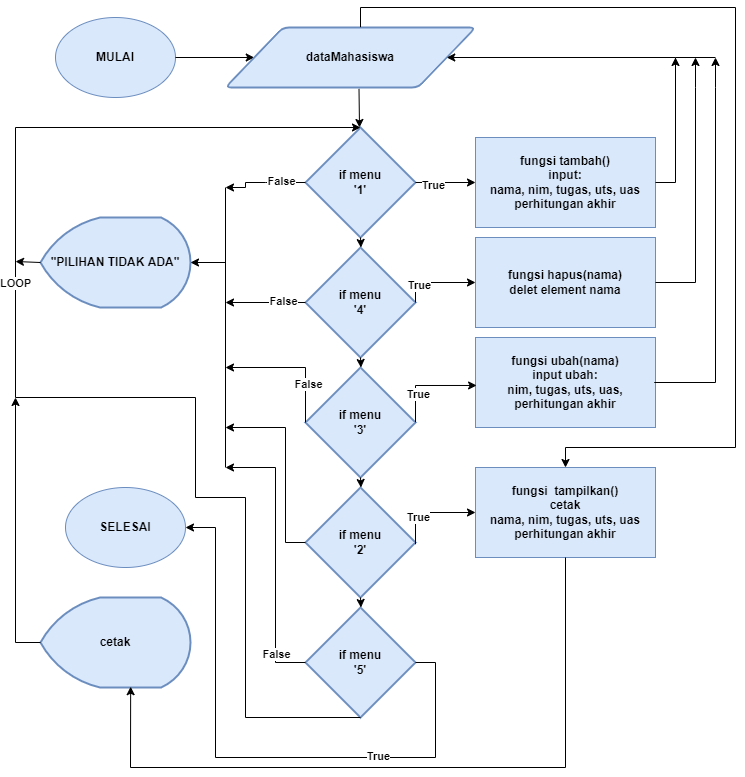
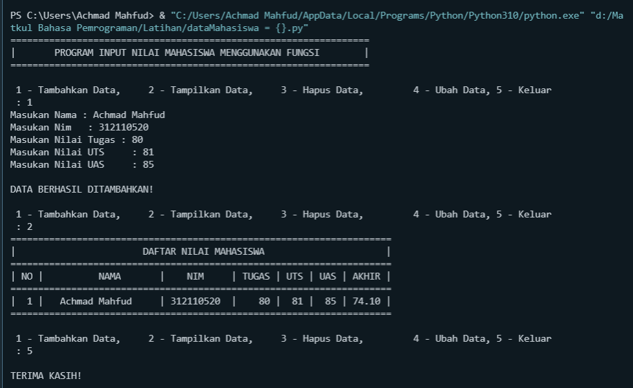

# <p align="center"> **TUGAS PRAKTIKUM**


    NAMA  : ACHMAD MAHFUD
    NIM   : 312110520
    KELAS : TI.21.C5

##  ***PERINTAH :***
    Buat program sederhana dengan mengaplikasikan penggunaan fungsi
    yang akan menampilkan daftar nilai mahasiswa, dengan ketentuan:
    1. Fungsi tambah() untuk menambah data2.
    2. Fungsi tapilkan() untuk menampilkan data
    3. Fungsi hapus(nama) untuk menghapus data berdasarkan nama
    4. Fungsi ubah(nama) untuk mengubah data berdasarkan nama
    5. Buat flowchart dan penjelasan programnya pada README.md.
    6. Commit dan push repository ke github.

## ***FLOWCHART :***


## ***PROGRAM :***
```sh
dataMahasiswa = {}

print("=" * 65)
print("|\tPROGRAM INPUT NILAI MAHASISWA MENGGUNAKAN FUNGSI\t|")
print("=" * 65)


def tambah():
        nama = str(input("Masukan Nama : "))
        nim = int(input("Masukan Nim   : "))
        tugas = int(input("Masukan Nilai Tugas : "))
        uts = int(input("Masukan Nilai UTS     : "))
        uas = int(input("Masukan Nilai UAS     : "))
        akhir = (tugas / 3) + (uts / 3.5) + (uas / 3.5)
        dataMahasiswa[nama] = nim, tugas, uts, uas, akhir,
        print("\nDATA BERHASIL DITAMBAHKAN!")
def tampilkan():
        print("=" * 69)
        print("|" + "\t" * 3 + "DAFTAR NILAI MAHASISWA" + "\t" * 3 +
                  "    |")
        print("=" * 69)
        print("| NO |   \tNAMA\t   |\tNIM \t| TUGAS | UTS | UAS | AKHIR |")
        print("=" * 69)
        for tampil in dataMahasiswa.items():
            no = 0
            no += 1
            print("| {6:2} |\t {0:15}   | {1:9} \t| {2:5} | {3:3} | {4:3} | {5:5} |".format(tampil[0], tampil[1][0], tampil[1][1], tampil[1][2], tampil[1][3],"%.2f" % float(tampil[1][4]), no))
            print("=" * 69)
def hapus(nama):
            del dataMahasiswa[nama]
            print("DATA BERHASIL DIHAPUS!")
 
def ubah(nama):
        if nama in dataMahasiswa.keys():
            nim = int(input("Masukan Nim  : "))
            tugas = int(input("Masukan Nilai Tugas : "))
            uts = int(input("Masukan Nilai UTS     : "))
            uas = int(input("Masukan Nilai UAS     : "))
            akhir = (tugas / 3) + (uts / 3.5) + (uas / 3.5)
            dataMahasiswa[nama] = nim, tugas, uts, uas, akhir
            print("\nDATA BERHASIL DI UBAH!")
        else:
            print("\DATA TIDAK DITEMUKAN!")

while True:
    data = input(
        "\n 1 - Tambahkan Data,\t 2 - Tampilkan Data,\t 3 - Hapus Data,\t 4 - Ubah Data, 5 - Keluar \n : "
    )
    if (data.lower() == '1'):
        tambah()

    elif (data.lower() == '4'):
        nama = str(input("Masukan Nama : "))
        ubah(nama)
    elif (data.lower() == '3'):
        nama = str(input("Masukan Nama : "))
        if nama in dataMahasiswa:
            hapus(nama)
        else:
            print("DATA TIDAK DITEMUKAN ".format(nama))
    elif (data.lower() == '2'):
        if dataMahasiswa.items():
            tampilkan()
        else:
            print("=" * 69)
            print("|" + "\t" * 3 + "DAFTAR NILAI MAHASISWA" + "\t" * 3 +
                  "    |")
            print("=" * 69)
            print("| NO |   \tNAMA\t   |\tNIM \t| TUGAS | UTS | UAS | AKHIR |")
            print("=" * 69)
            print("|    " + "\t" * 3 + "TIDAK ADA DATA!" + "\t" * 4 + "    |")
            print("=" * 69)
    elif (data.lower() == '5'):
        print("\nTERIMA KASIH! \n")
        exit()
    else:
        print("YANG ANDA CARI TIDAK ADA!")


```
## ***PENJELASAN :***
    1. Fungsi tambah() untuk menambah data
    2. Fungsi tapilkan() untuk menampilkan data
    3. Fungsi hapus(nama) untuk menghapus data berdasarkan nama
    4. Fungsi ubah(nama) untuk mengubah data berdasarkan nama
   
## ***OUTPUT PROGRAM :***

